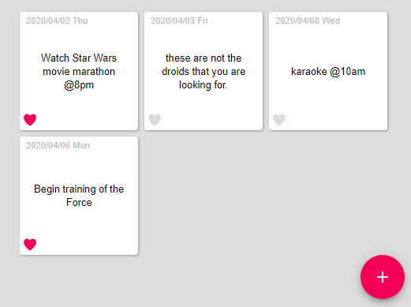

react-crud-app
================

This project was bootstrapped with [Next.JS](https://nextjs.org/).

## Description
This is part of the series of exercises to demonstrate MERN stack.

* Server: [express-mysql](http://github.com/supershaneski/express-mysql) (mySQL version)
* Server: [express-mongodb](http://github.com/supershaneski/express-mongodb)
* Client: [react-crud-app](http://github.com/supershaneski/react-crud-app) (this repository)

This is a just simple Todo app.<br>
It consumes the API service of the CRUD server.



Please run the express-mongodb application server first.


## Installation
Clone repository and run

```
npm install
```

## Run
Runs the app in the development mode

```
npm run dev
```

Open [http://localhost:3000](http://localhost:3000) to view it in the browser.

The page will reload if you make edits.<br>
You will also see any lint errors in the console.
